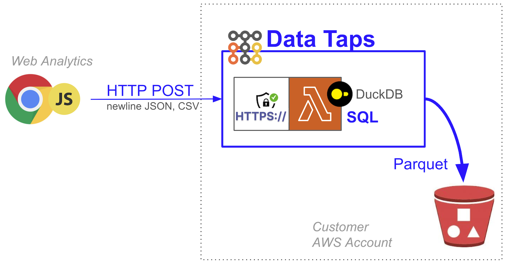

[FluentBit](https://github.com/boilingdata/data-taps-fluentbit-example) | [Web Analytics](https://github.com/boilingdata/data-taps-webanalytics-example) | [PostgreSQL CDC](https://github.com/boilingdata/data-taps-postgres-cdc) | [REST API](https://github.com/boilingdata/data-taps-nycopendata-example) | [OpenSearch/ES](https://github.com/boilingdata/data-taps-opensearch-to-s3) | [AWS Lambda Telemetry](https://github.com/dforsber/data-taps-lambda-extension)

# Web Analytics --> Data Tap --> S3 Parquet

<p align="center">
  
</p>

This is an e2e web analytics data collection example. This repository contains JS snippet on a HTML page you open with your browser. The JS snippet will collect events like clicks and mouse movements and send them into Data Tap. The Data Tap collects the events and stores into S3.

## Data Tap

A Data Tap is a single AWS Lambda function with [Function URL](https://docs.aws.amazon.com/lambda/latest/dg/lambda-urls.html) and customized C++ runtime embedding [DuckDB](https://www.duckdb.org/). It uses streaming SQL clause to upload the buffered HTTP POSTed newline JSON data in the Lambda to S3, hive partitioned, and as ZSTD compressed Parquet. You can tune the SQL clause your self for filtering, search, and aggregations. You can also set the thresholds when the upload to S3 happens. A Data Tap runs already very efficiently with the smallest arm64 AWS Lambda, making it the simplest, fastest, and most cost efficient solution for streaming data onto S3 in scale. You can run it on [your own AWS Account](https://github.com/boilingdata/data-taps-template) or hosted by Boiling Cloud.

You need to have [BoilingData account](https://github.com/boilingdata/boilingdata-bdcli) and use it to create a [Data Tap](https://github.com/boilingdata/data-taps-template). The account is used to [fetch authorization tokens](https://github.com/boilingdata/data-taps-template?tab=readme-ov-file#3-get-token-and-ingestion-url-and-send-data) which allow you to send data to a Data Tap (security access control). You can also share write access (see the `AUTHORIZED_USERS` AWS Lambda environment variable) to other BoilingData users if you like, efficiently creating Data Mesh architectures.

## Prerequisites

1. First, you need a Data Tap on your AWS Account. You can follow these instructions.
   https://github.com/boilingdata/data-taps-template/tree/main/aws_sam_template

2. Export fresh tap token as TAP_TOKEN environment variable and TAP_URL env var as the Tap ingestion URL endpoint.

```shell
# 1. You will get the TAP URL from the Tap deployment you did in the first step
export TAP_URL='https://...'
# 2a. If you send to your own Data Tap (sharing user is the as your BoilingData username)
export TAP_TOKEN=`bdcli account tap-client-token --disable-spinner | jq -r .bdTapToken`
# 2b. If you send to somebody else's Data Tap, replace "boilingSharingUsername"
export TAP_TOKEN=`bdcli account tap-client-token --sharing-user boilingSharingUsername --disable-spinner | jq -r .bdTapToken`
```

## Collecting Data

This repository contains a JS snippet you can put on web pages and it will send analytics data to configured Data Tap. It sends newline JSON events with various types. It collects page load, click, and mouse movement events. Using this data while having the URL where the snippet is being run allows you to for example re-construct the users' activity on the page and visualize the mouse movements. Some companies do this for you as a service too.

The JavaScript is on [src/webclient.js](src/webclient.js). We could put it as-is into the web page but it helps to tree-shake compile it into minified version so that loading it is more efficient. We use [esbuild](https://esbuild.github.io/) for this purpose.

Build the source and open the generated HTML file on your browser and start clicking and moving your mouse. You can check the browser developer console when the JS sends the data to the Data Tap (fetch calls). Please note that this script is very rudimentary.

```shell
yarn install
yarn build
yarn open # or open the generated test.html file manually with your Browser
```

## Checking Data

You can check the uploaded Parquet files in your S3 bucket and download them to your local laptop and get a glimpse into them with e.g. [DuckDB](https://duckdb.org/).

```shell
aws s3 sync s3://YOURBUCKET/datataps/ d/
duckdb -s "SELECT COUNT(*) AS events, eventType FROM parquet_scan('./d/**/*.parquet') GROUP BY eventType;"
┌────────┬───────────┐
│ events │ eventType │
│ int64  │  varchar  │
├────────┼───────────┤
│      1 │ pageleave │
│      4 │ pageload  │
│     92 │ click     │
│      1 │ keydown   │
│   2440 │ mousemove │
└────────┴───────────┘
```

Alternatively you can run the analytics on the cloud side with BoilingData. For example, a one-off SQL query with bdcli.

```shell
bdcli api query  -s "SELECT COUNT(*) AS events, eventType FROM parquet_scan('s3://YOURBUCKET/datataps/') GROUP BY eventType;"

```
